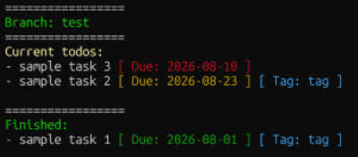

# todo-cli

This is a simple command-line todo management tool for linux environment.

## Requirements

python > 3.8 is recommended.

## Main Features

- Basic functionalities of todo management tool are available such as: 
    - make, delete, rename, show todos, mark them as finished
    - set deadlines, add tags
- Branch enables more hierarchical todo management; branch means a new isolated todo list derived from the current one, and users can organize groups of todos into different branches without adding many tags to them.
- Note feature can be used to add remarks, more datails about the task, or subtasks.

## Installation

Clone this repository and run: `./install.sh`

Then you can use just by running `todo init` . 
To check the usage, type `todo` .

## Commands List

Commands below are available and can be run by `todo <command>`.

| command | Description |
|---------|-------------|
| `init` | initialize |
| `view [-a] [-t] [-f <tag>]` | show current todos |
| `make <name1> <name2> ...` | make new todos |
| `rename <target> <newname>` | rename existing todo |
| `done <name1> <name2> ...` | mark todos as finished |
| `undone <name1> <name2> ...` | mark todos as not finished |
| `del <name1> <name2> ...` | remove todos which are not finished |
| `note <todo>` | write notes (markdown file) linked to the todo (vim opens) |
| `tag [-rm] <todo name1> <todo name2> ... <tag name>` | add [remove] a tag on the todos |
| `due [-rm] <todo name1> <todo name2> ... <YYYY-MM-DD>` | set [remove] due date for the todos |
| `branch [-rm] <branch name>` | create [remove] a branch |
| `switch <branch name>` | switch to the branch |
| `clean` | delete all the finished todos |

### Options

- `[-a]` in `view` : include finished todo (only remained todos are shown by default).
- `[-t]` in `view` : sort todos by tags (todos are sorted by their deadlines by default).
- `[-f <tag>]` in `view` : show all the todos with the `<tag>`.
- `[-rm]` in `tag`,  `due`, and `branch` : remove the targets.

## Tips

- Shell completion is available for todo names when you run such as `todo done` or `todo note`. Press Tab key to use the completion just as you usually do in command line.

## Customize

- The editor used for `todo note` can be changed by editing constant `EDITOR_FOR_NOTES` in `src/config.py` e.g. `EDITOR_FOR_NOTES = "nvim"`. (Default: vim)

- Finished todos are automatically deleted when the number of it become more than 15. This number can be changed by editing `CLEAN_NUM` in `src/config.py` . (Finished todos can be deleted manually as well by running `todo clean`)

- The directory where todos are saved can be changed by editing `TODO_SAVE` in `src/config.py`. If one sets `TODO_SAVE` a directory in the cloud such as Onedrive, one will be able to sync the todos on different devices. Make sure to run `todo init` again after changing `TODO_SAVE`, and copy the existing json file and notes file in the former `TODO_SAVE` directory (it is initially ~/todo_cli).

## Examples
- Initialize: `todo init`

- Add a todo "read an article": `todo make "read an article"` 
(*Use quotation mark for todo's name, if it contains space!)

- View: `todo view` 
(Output: `- read an article`)

- Set the due date: `todo due "read an article" 2026-08-01`

- Add a tag: `todo tag "read an article" research`

- View again: `todo view` 
(Output: `- read an article | Due: 2026-08-01 | Tag: research `) 

- Add the link to the article as notes: `todo note "read an article"` 
(One can paste the link in the todo file)

- Mark it as done: `todo done "read an article"`
